## System Architecture

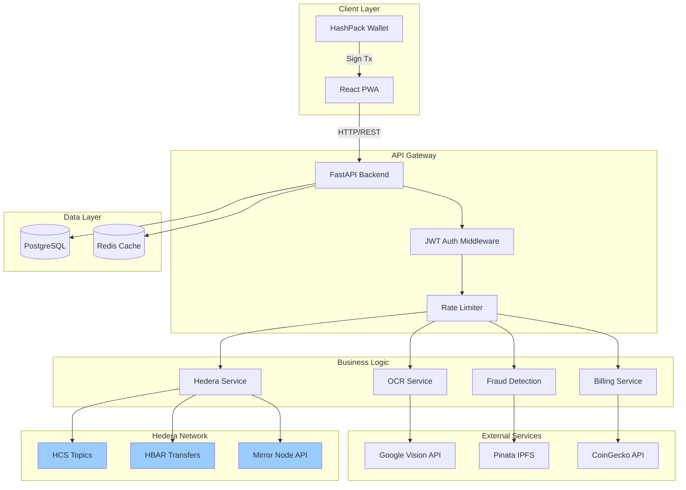

## Core User Flows

### 1. User Registration & Wallet Connection

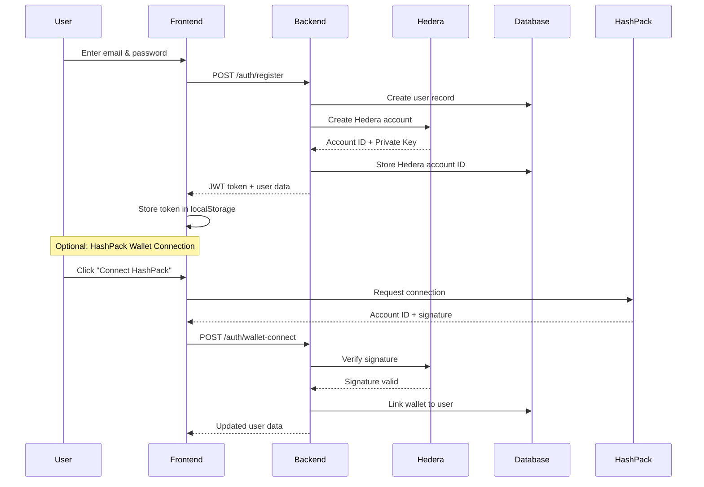

### 2. Meter Registration

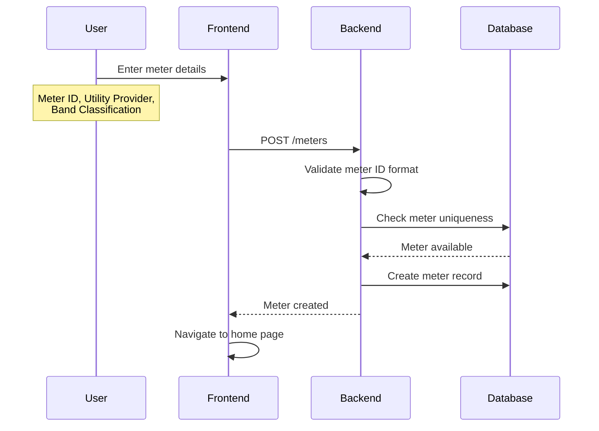

### 3. Meter Reading Verification (Core Flow)

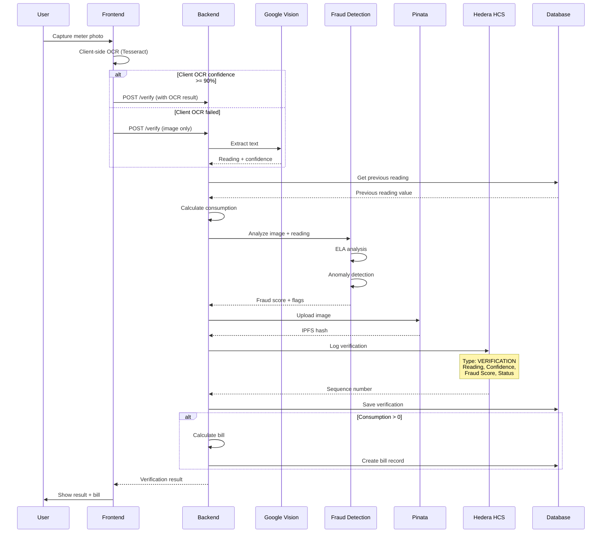

### 4. Bill Payment Flow

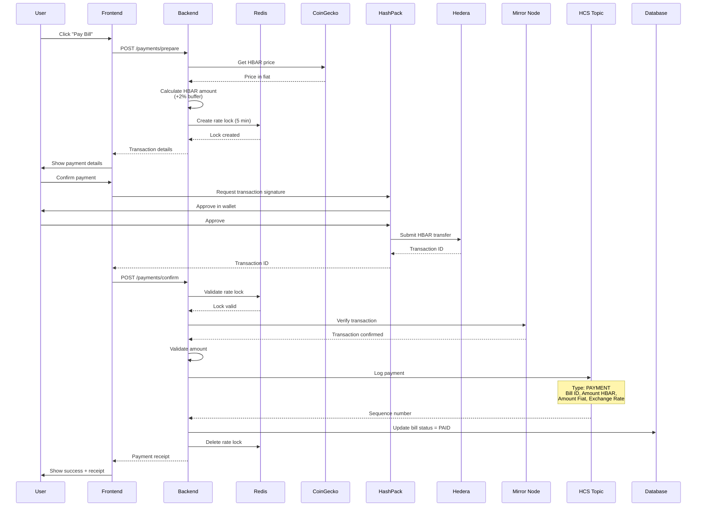

### 5. Dispute Flow (Future)

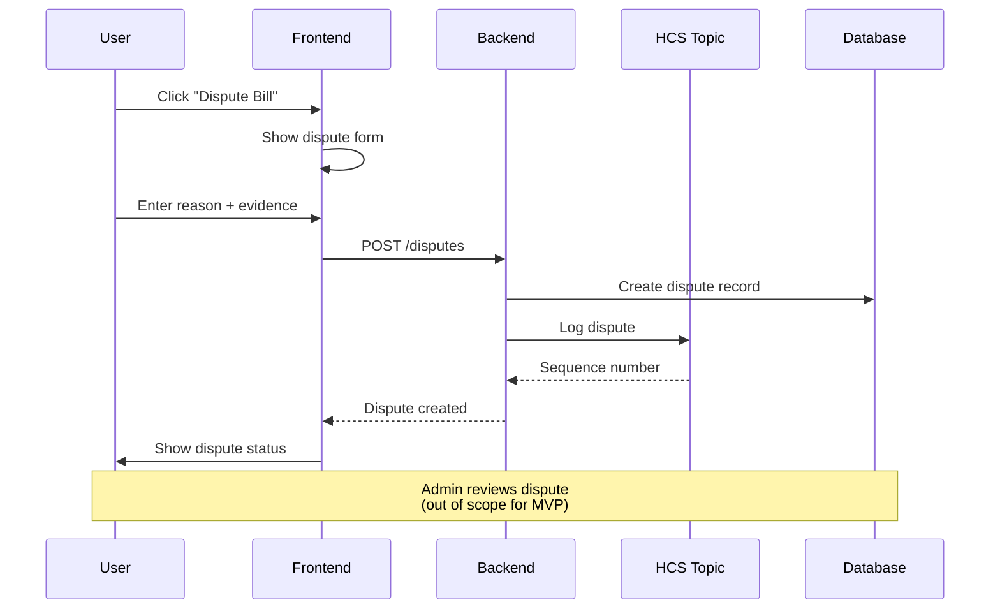

## Module Interactions

### Backend Service Architecture

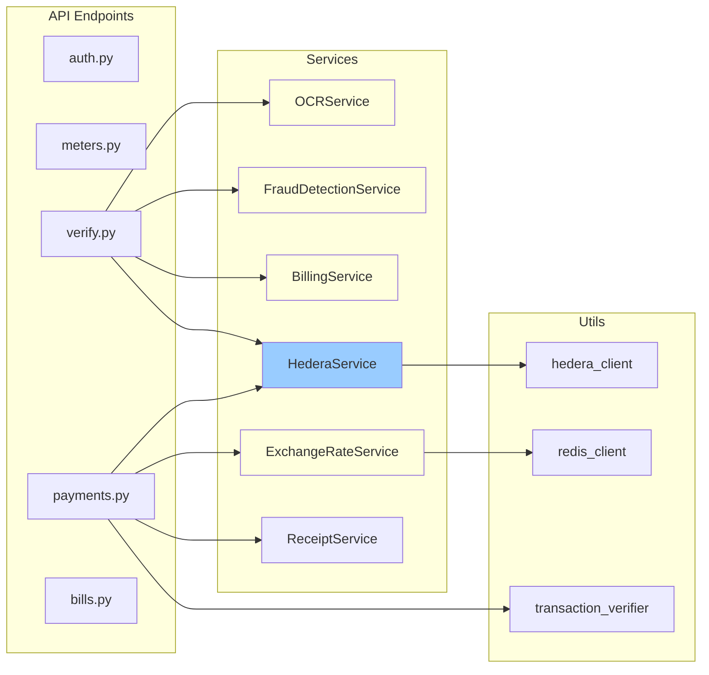

### Frontend Component Hierarchy

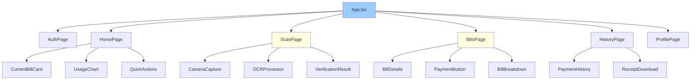

## Data Flow Patterns

### 1. Caching Strategy

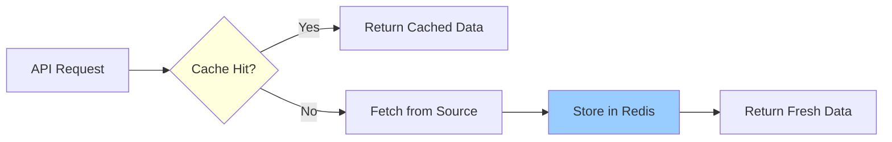

**Cache TTLs:**
- Exchange rates: 5 minutes
- Tariff data: 1 hour
- User preferences: 15 minutes
- Rate locks: 5 minutes (exact)

### 2. Error Handling Flow

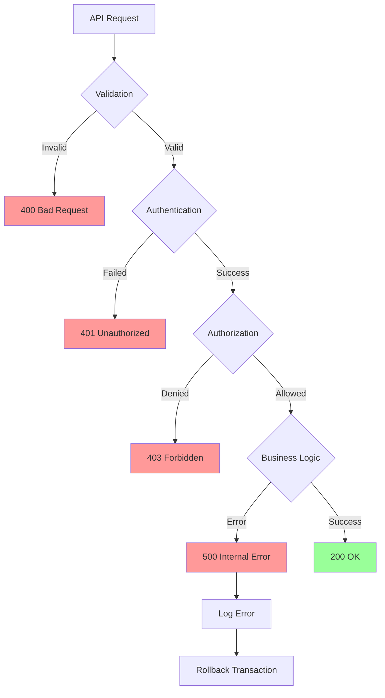

### 3. Transaction Verification

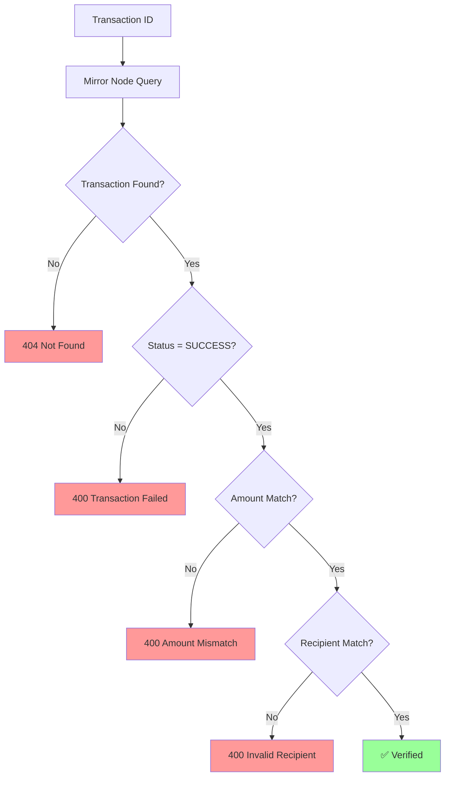

## Security Architecture

### Authentication Flow

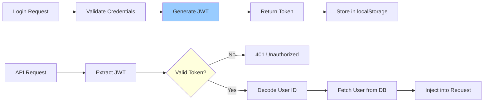

### Rate Limiting

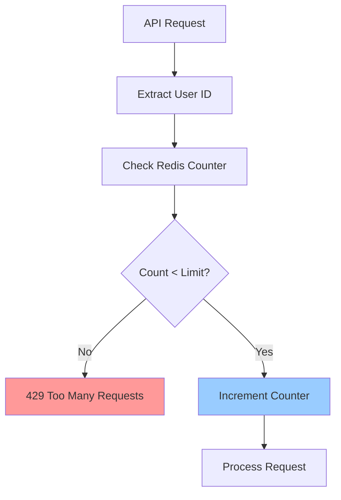

## Scalability Considerations

### Horizontal Scaling

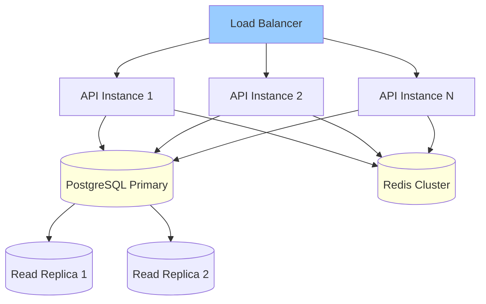

### Regional HCS Topics

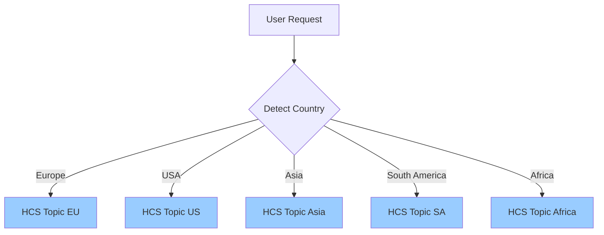

---

**Next**: [Getting Started →](/quickstart) | [API Reference →](/api-reference/introduction)
