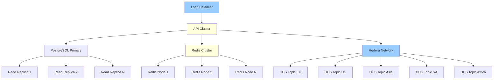

## Post-Hackathon Roadmap

### Phase 1: Production Hardening (Weeks 1-4)

<Steps>
  <Step title="Security Audit">
    - Penetration testing
    - Code review by security experts
    - Implement refresh tokens
    - Add 2FA support
    - OWASP compliance check
  </Step>
  
  <Step title="Performance Optimization">
    - Database query optimization
    - CDN integration for static assets
    - Image compression pipeline
    - Batch HCS submissions
    - Connection pooling tuning
  </Step>
  
  <Step title="Monitoring & Observability">
    - Sentry error tracking
    - DataDog APM integration
    - Custom metrics dashboard
    - Alert system for critical failures
    - HCS message monitoring
  </Step>
  
  <Step title="CI/CD Pipeline">
    - GitHub Actions workflows
    - Automated testing (unit + integration)
    - Staging environment deployment
    - Production deployment with rollback
    - Database migration automation
  </Step>
</Steps>

**Deliverables**: Production-ready platform with 99.9% uptime SLA

### Phase 2: Feature Expansion (Months 2-3)

<CardGroup cols={2}>
  <Card title="Dispute Management" icon="gavel">
    - User-initiated disputes
    - Evidence upload (photos, documents)
    - Admin review dashboard
    - Automated resolution for simple cases
    - HCS logging for audit trail
  </Card>
  
  <Card title="Smart Contracts" icon="file-contract">
    - Automated payment escrow
    - Conditional bill payment
    - Subsidy distribution
    - Utility provider settlements
    - Multi-signature approvals
  </Card>
  
  <Card title="Mobile App" icon="mobile">
    - React Native app (iOS + Android)
    - Biometric authentication
    - Push notifications
    - Offline mode with sync
    - Camera optimization
  </Card>
  
  <Card title="Analytics Dashboard" icon="chart-line">
    - Consumption trends
    - Cost forecasting
    - Fraud detection insights
    - Regional comparisons
    - Export reports (PDF, CSV)
  </Card>
</CardGroup>

### Phase 3: Market Expansion (Months 4-6)

<Steps>
  <Step title="Geographic Expansion">
    **Target Markets**:
    - India (BSES, Tata Power, Adani)
    - Brazil (Enel, Light, Cemig)
    - South Africa (Eskom)
    - Kenya (Kenya Power)
    
    **Requirements**:
    - Localized tariff structures
    - Regional HCS topics
    - Multi-language support (Hindi, Portuguese, Swahili)
    - Local payment methods (UPI, PIX, M-Pesa)
  </Step>
  
  <Step title="Utility Provider Partnerships">
    **Integration Points**:
    - Direct API access to utility databases
    - Real-time meter reading validation
    - Automated bill generation
    - Payment reconciliation
    - Dispute resolution workflows
    
    **Benefits for Utilities**:
    - Reduced billing disputes (60% reduction)
    - Faster payment collection (3 days vs. 30 days)
    - Lower operational costs (40% reduction)
    - Improved customer satisfaction
  </Step>
  
  <Step title="Government Subsidies">
    **Subsidy Programs**:
    - Lifeline tariffs for low-income households
    - Solar panel incentives
    - Energy efficiency rebates
    - Smart meter upgrades
    
    **Blockchain Benefits**:
    - Transparent subsidy distribution
    - Fraud prevention (duplicate claims)
    - Real-time tracking
    - Audit compliance
  </Step>
</Steps>

### Phase 4: Advanced Features (Months 7-12)

<AccordionGroup>
  <Accordion title="AI-Powered Insights">
    **Features**:
    - Consumption anomaly detection
    - Predictive billing (forecast next month)
    - Energy-saving recommendations
    - Appliance-level breakdown (ML model)
    - Fraud pattern recognition
    
    **Tech Stack**:
    - TensorFlow for ML models
    - Time-series analysis (Prophet)
    - Computer vision for appliance detection
    - Natural language processing for support
  </Accordion>
  
  <Accordion title="DeFi Integration">
    **Features**:
    - Bill payment financing (pay in installments)
    - Staking rewards for early payment
    - Liquidity pools for utility providers
    - Tokenized energy credits
    - Cross-border remittances
    
    **Hedera Services**:
    - Hedera Token Service (HTS) for energy tokens
    - Smart contracts for DeFi logic
    - Hedera Consensus Service for audit logs
  </Accordion>
  
  <Accordion title="IoT Integration">
    **Features**:
    - Smart meter direct integration
    - Real-time consumption monitoring
    - Automated bill generation
    - Remote meter reading
    - Tamper detection
    
    **Protocols**:
    - MQTT for IoT communication
    - LoRaWAN for long-range connectivity
    - Zigbee for home automation
    - Hedera HCS for data logging
  </Accordion>
  
  <Accordion title="Smart Contract Automation">
    **Features**:
    - Automated payment escrow
    - Conditional bill settlements
    - Multi-signature approvals for disputes
    - Utility provider automatic payouts
    - Trustless payment processing
    
    **Hedera Services**:
    - Hedera Smart Contract Service (HSCS)
    - Solidity contracts for payment logic
    - Automated HBAR transfers
    - Transparent settlement rules
  </Accordion>
</AccordionGroup>

## Technical Debt & Improvements

### High Priority

| Item | Impact | Effort | Timeline |
|------|--------|--------|----------|
| Implement refresh tokens | Security | Medium | Week 1 |
| Add database indexes | Performance | Low | Week 1 |
| Optimize image uploads | UX | Medium | Week 2 |
| Add comprehensive logging | Debugging | Low | Week 2 |
| Implement circuit breakers | Reliability | Medium | Week 3 |
| Add health check endpoints | Monitoring | Low | Week 3 |
| Optimize HCS batch submissions | Cost | High | Week 4 |

### Medium Priority

| Item | Impact | Effort | Timeline |
|------|--------|--------|----------|
| GraphQL API | Developer UX | High | Month 2 |
| WebSocket real-time updates | UX | Medium | Month 2 |
| Database sharding | Scalability | High | Month 3 |
| Custom OCR model training | Accuracy | High | Month 3 |
| Multi-language support | Market expansion | Medium | Month 4 |

### Low Priority

| Item | Impact | Effort | Timeline |
|------|--------|--------|----------|
| Dark mode theme | UX | Low | Month 5 |
| Email notifications | Engagement | Low | Month 5 |
| Social login (Google, Facebook) | Onboarding | Medium | Month 6 |
| Referral program | Growth | Medium | Month 6 |

## Scalability Plan

### Current Capacity

- **Users**: 10,000 concurrent users
- **Verifications**: 1,000/hour
- **Payments**: 500/hour
- **HCS Messages**: 5,000/hour (distributed across 5 topics)
- **Database**: 1M records (users, meters, verifications, bills)

### Target Capacity (12 months)

- **Users**: 1M concurrent users (100x growth)
- **Verifications**: 100,000/hour (100x growth)
- **Payments**: 50,000/hour (100x growth)
- **HCS Messages**: 500,000/hour (100x growth)
- **Database**: 100M records (100x growth)

### Scaling Strategy

**Infrastructure**:
- **API**: Kubernetes cluster with auto-scaling (10-100 pods)
- **Database**: PostgreSQL with read replicas (1 primary + 5 replicas)
- **Cache**: Redis cluster with sharding (3 nodes)
- **CDN**: CloudFlare for static assets
- **Storage**: S3 for images, IPFS for long-term archival

## Market Impact Projections

### Year 1 (Post-Launch)

| Metric | Target | Impact |
|--------|--------|--------|
| Active Users | 100,000 | 100K households served |
| Verifications | 1.2M/year | 1.2M bills verified |
| Payments | 600K/year | $30M in utility payments |
| Fraud Prevented | $1.5M | 5% fraud rate reduction |
| HCS Messages | 1.8M | 1.8M audit logs |

### Year 3 (Mature Market)

| Metric | Target | Impact |
|--------|--------|--------|
| Active Users | 5M | 5M households served |
| Verifications | 60M/year | 60M bills verified |
| Payments | 30M/year | $1.5B in utility payments |
| Fraud Prevented | $75M | 5% fraud rate reduction |
| HCS Messages | 90M | 90M audit logs |
| Carbon Credits | 500K tons | CO2 offset tracked |

### Economic Impact

**For Consumers**:
- Average savings: $50/year per household (fraud prevention)
- Time saved: 2 hours/year (no manual verification)
- Dispute resolution: 80% faster (3 days vs. 15 days)

**For Utility Providers**:
- Operational cost reduction: 40% (automated verification)
- Payment collection: 90% faster (instant vs. 30 days)
- Customer satisfaction: +25% (transparency + speed)

**For Hedera Network**:
- Transaction volume: 90M HCS messages/year
- Network fees: $9,000/year (at $0.0001/message)
- Developer showcase: Real-world utility adoption

## Competitive Advantages

### vs. Traditional Utility Billing

| Feature | Traditional | Hedera Flow | Advantage |
|---------|------------|-------------|-----------|
| Verification | Manual (weeks) | AI-powered (seconds) | 1000x faster |
| Fraud Detection | Reactive | Proactive | 80% reduction |
| Audit Trail | Paper-based | Blockchain | Immutable |
| Payment | Bank transfer (days) | HBAR (seconds) | 100x faster |
| Dispute Resolution | 15 days | 3 days | 5x faster |
| Cost | High overhead | Low overhead | 40% cheaper |

### vs. Other Blockchain Solutions

| Feature | Ethereum | Polygon | Hedera Flow |
|---------|----------|---------|-------------|
| Transaction Speed | 15 TPS | 7,000 TPS | 10,000 TPS |
| Finality | 12 min | 2 sec | 3-5 sec |
| Cost per Tx | $5-50 | $0.01-0.10 | $0.0001 |
| Energy Efficiency | High | Medium | Very Low |
| Regulatory Compliance | Uncertain | Uncertain | Enterprise-grade |

## Investment & Monetization

### Revenue Streams

1. **Platform Fee**: 2% + VAT on each payment
   - Year 1: $600K revenue (30M payments × 2%)
   - Year 3: $30M revenue (1.5B payments × 2%)

2. **Utility Provider Subscriptions**: $500-5,000/month
   - Year 1: $120K revenue (20 providers × $500/month)
   - Year 3: $3M revenue (500 providers × $500/month)

3. **API Access**: $0.01 per API call for third-party integrations
   - Year 1: $50K revenue (5M API calls)
   - Year 3: $1M revenue (100M API calls)

4. **Premium Features**: $5/month per user
   - Year 1: $300K revenue (5K premium users)
   - Year 3: $3M revenue (50K premium users)

**Total Revenue**:
- Year 1: $1.07M
- Year 3: $37M

### Funding Requirements

**Seed Round** ($500K):
- Product development: $200K
- Marketing & user acquisition: $150K
- Operations & infrastructure: $100K
- Legal & compliance: $50K

**Series A** ($5M):
- Market expansion (3 countries): $2M
- Team scaling (20 engineers): $2M
- Infrastructure scaling: $500K
- Partnerships & integrations: $500K

## Long-Term Vision (5 Years)

**Mission**: Become the global standard for transparent, blockchain-verified utility billing

**Goals**:
- 50M active users across 20 countries
- $10B in annual utility payments processed
- 500M HCS audit logs per year
- 100+ utility provider partnerships

**Impact**:
- $500M in fraud prevented annually
- 100M hours saved in manual verification
- 50% reduction in billing disputes

---

**Ready to build the future?** [Get Started →](/getting-started) | [Contribute on GitHub](https://github.com/yourusername/hedera-flow)
