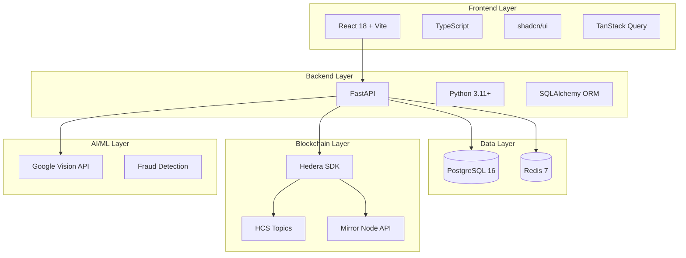

## Architecture Overview

Hedera Flow uses a modern, production-ready stack optimized for performance, scalability, and blockchain integration.



## Frontend Stack

### Core Framework
- **React 18.3.1**: Modern UI with concurrent features
- **Vite 5.4**: Lightning-fast dev server and HMR
- **TypeScript 5.8**: Type-safe development
- **React Router 6.30**: Client-side routing

### UI & Styling
- **shadcn/ui**: 40+ accessible components built on Radix UI
- **Tailwind CSS 3.4**: Utility-first styling
- **Framer Motion 12**: Smooth animations
- **Lucide React**: 1000+ icons

### State Management
- **TanStack Query 5.83**: Server state management with caching
- **React Hook Form 7.61**: Form validation with Zod schemas
- **Axios 1.13**: HTTP client with interceptors

### Blockchain Integration
- **@hashgraph/sdk 2.80**: Hedera JavaScript SDK
- **hashconnect 3.0**: HashPack wallet integration
- **Buffer polyfill**: Node.js compatibility for browser

### Key Features
```typescript
// Type-safe API client with automatic JWT injection
import { authApi, metersApi, billsApi } from '@/lib/api';

// React Query hooks for data fetching
const { data: bills, isLoading } = useBills();

// Form validation with Zod
const schema = z.object({
  meter_id: z.string().min(8),
  utility_provider: z.string()
});
```

## Backend Stack

### Core Framework
- **FastAPI 0.109**: High-performance async API framework
- **Uvicorn 0.27**: ASGI server with WebSocket support
- **Pydantic 2.5**: Data validation and serialization
- **Python 3.11+**: Modern Python with performance improvements

### Database & ORM
- **SQLAlchemy 2.0**: Async ORM with type hints
- **Alembic 1.13**: Database migrations
- **psycopg2-binary 2.9**: PostgreSQL adapter

### Authentication & Security
- **python-jose 3.3**: JWT token generation
- **passlib 1.7**: Password hashing (bcrypt)
- **slowapi 0.1**: Rate limiting middleware

### Blockchain Integration
- **hedera-sdk-py 2.21**: Official Hedera Python SDK
- **httpx 0.26**: Async HTTP client for Mirror Node
- **aiohttp 3.9**: Async HTTP for external APIs

### AI & Image Processing
- **google-cloud-vision 3.12**: OCR and label detection
- **Pillow 12.1**: Image manipulation for fraud detection
- **numpy 2.4**: Numerical operations for ELA analysis

### Utilities
- **redis 5.0**: Caching and rate limiting
- **requests 2.31**: HTTP client for exchange rates
- **reportlab 4.0**: PDF receipt generation
- **qrcode 8.0**: QR code generation

### Key Features
```python
# Async API endpoints with dependency injection
@router.post("/verify", response_model=VerificationResponse)
async def create_verification(
    meter_id: str = Form(...),
    image: UploadFile = File(...),
    db: Session = Depends(get_db),
    current_user: dict = Depends(get_current_user)
):
    # OCR processing
    ocr_result = ocr_service.extract_reading(image_bytes)
    
    # Fraud detection
    fraud_score = fraud_service.calculate_fraud_score(...)
    
    # HCS logging
    hcs_result = await hedera_client.submit_hcs_message(...)
```

## Database Layer

### PostgreSQL 16 (Supabase)
- **Connection Pooling**: 20 connections, 10 overflow
- **Migrations**: Alembic-managed schema versioning
- **Indexes**: Optimized for user_id, meter_id, bill_id queries
- **JSON Support**: Tariff snapshots and fraud flags

### Redis 7 (Upstash)
- **Caching**: Exchange rates (5-min TTL), tariff data (1-hour TTL)
- **Rate Limiting**: 100 requests/minute per user
- **Rate Locks**: 5-minute payment rate protection
- **Session Storage**: JWT token blacklisting (future)

### Schema Highlights
```sql
-- Users with Hedera account linking
CREATE TABLE users (
    id UUID PRIMARY KEY,
    email VARCHAR UNIQUE NOT NULL,
    hedera_account_id VARCHAR,
    wallet_type VARCHAR,
    country_code VARCHAR(2)
);

-- Meters with utility provider mapping
CREATE TABLE meters (
    id UUID PRIMARY KEY,
    user_id UUID REFERENCES users(id),
    meter_id VARCHAR UNIQUE,
    utility_provider VARCHAR,
    band_classification VARCHAR
);

-- Verifications with HCS references
CREATE TABLE verifications (
    id UUID PRIMARY KEY,
    meter_id UUID REFERENCES meters(id),
    reading_value DECIMAL,
    confidence DECIMAL,
    fraud_score DECIMAL,
    hcs_topic_id VARCHAR,
    hcs_sequence_number BIGINT,
    image_ipfs_hash VARCHAR
);
```

## Hedera Integration

### Hedera SDK
- **Network**: Testnet (mainnet-ready)
- **Operator Account**: 0.0.xxxxx (treasury)
- **Services Used**: HCS, HBAR transfers, Mirror Node queries

### HCS Topics (Regional)
```python
HCS_TOPICS = {
    'ES': '0.0.8052384',  # Europe
    'US': '0.0.8052396',  # United States
    'IN': '0.0.8052389',  # Asia
    'BR': '0.0.8052390',  # South America
    'NG': '0.0.8052391'   # Africa
}
```

### Message Format
```json
{
  "type": "VERIFICATION",
  "timestamp": 1704067200,
  "meter_id": "ABC123456",
  "reading": 12345.67,
  "confidence": 0.95,
  "fraud_score": 0.12,
  "status": "VERIFIED",
  "image_hash": "ipfs://Qm..."
}
```

### Mirror Node API
- **Transaction Verification**: Validate HBAR payments
- **Account Queries**: Fetch account balances
- **Topic Messages**: Retrieve HCS message history
- **Rate Limiting**: 100 requests/10 seconds

## AI & ML Services

### Google Cloud Vision API
- **Text Detection**: Extract meter readings from photos
- **Label Detection**: Identify meter type (analog/digital)
- **Confidence Scoring**: 0-100% accuracy estimation
- **Error Handling**: Retry logic with exponential backoff

### Fraud Detection
- **ELA Analysis**: Error Level Analysis for image tampering
- **Anomaly Detection**: Statistical outlier detection
- **Historical Comparison**: Pattern matching against previous readings
- **Multi-Factor Scoring**: Weighted fraud probability (0-1)

```python
fraud_result = {
    'fraud_score': 0.15,
    'flags': {
        'ela_suspicious': False,
        'reading_anomaly': False,
        'metadata_mismatch': False
    }
}
```

## External APIs

### Exchange Rate Services
- **Primary**: CoinGecko API (free tier)
- **Fallback**: CoinMarketCap API
- **Caching**: 5-minute Redis cache
- **Currencies**: EUR, USD, NGN, INR, BRL

### IPFS Storage (Pinata)
- **Image Storage**: Meter photos uploaded to IPFS
- **Gateway**: Public IPFS gateway for retrieval
- **Metadata**: Filename, timestamp, content type

## DevOps & Deployment

### Docker Compose
```yaml
services:
  postgres:
    image: postgres:16-alpine
    ports: ["5432:5432"]
  
  redis:
    image: redis:7-alpine
    ports: ["6379:6379"]
```

### Environment Configuration
- **Development**: `.env.local` with local database
- **Production**: `.env.production` with Supabase/Upstash
- **Secrets**: Hedera keys, API keys, JWT secret

### CI/CD (Planned)
- **GitHub Actions**: Automated testing and deployment
- **Docker Build**: Multi-stage builds for optimization
- **Health Checks**: `/health` endpoint monitoring

## Performance Optimizations

1. **Frontend**
   - Code splitting with React.lazy()
   - Image optimization with WebP
   - TanStack Query caching (5-min stale time)

2. **Backend**
   - Redis caching for exchange rates and tariffs
   - Database connection pooling
   - Async I/O for external API calls

3. **Blockchain**
   - Batch HCS submissions (future)
   - Mirror Node query caching
   - Rate lock mechanism for payment protection

## Security Measures

- **Authentication**: JWT tokens with 30-day expiration
- **Rate Limiting**: 100 requests/minute per user
- **Input Validation**: Pydantic schemas for all endpoints
- **SQL Injection**: SQLAlchemy ORM with parameterized queries
- **CORS**: Whitelist for allowed origins
- **Secrets**: Environment variables, never committed

---

**Next**: [Getting Started →](/quickstart)
